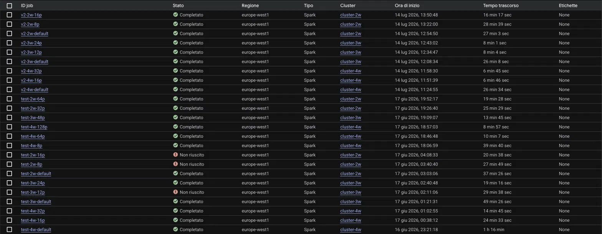

# Earthquake Co-Occurrence Analysis with Apache Spark

Project for the **Scalable and Cloud Programming** course — University of Bologna, A.Y. 2025/2026.

Distributed co-occurrence analysis of earthquake events, implemented in **Scala + Spark (RDD / MapReduce API)** and evaluated on **Google Cloud Dataproc** with two alternative algorithms, three cluster sizes (2, 3, 4 workers) and multiple partitioning strategies.

- [Objective](#objective)
- [Dataset](#dataset)
- [Repository structure](#repository-structure)
- [The two implementations](#the-two-implementations)
- [Result of the analysis](#result-of-the-analysis)
- [How to build](#how-to-build)
- [How to run on Dataproc](#how-to-run-on-dataproc)
- [Automated experiments](#automated-experiments)
- [Experimental results](#experimental-results)
- [Local testing (optional)](#local-testing-optional)
- [Author](#author)

---

## Objective

Find the **pair of geographic locations whose earthquakes co-occur most frequently on the same day**, and print that pair together with the list of co-occurrence dates in ascending order.

Processing rules (from the [assignment](project-description.pdf)):

| Rule | Meaning |
| --- | --- |
| **Spatial aggregation** | Latitude and longitude are rounded to the first decimal digit (half-up). `112.234, 81.593` → cell `(112.2, 81.6)` |
| **Temporal aggregation** | Only the day matters: `2025-01-01 00:00:01` and `2025-01-01 23:59:59` → `2025-01-01` |
| **Duplicate removal** | Multiple events in the same cell on the same day count as **one** event (otherwise the top pair could be a cell paired with itself) |

Expected output format:

```text
((37.5, 15.3), (38.1, 13.4))
2024-03-12
2024-04-01
2024-04-03
```

## Dataset

Two CSV files are provided with the assignment (not committed to this repository because of their size):

| File | Events | Size | Use |
| --- | --- | --- | --- |
| `dataset-earthquakes-full.csv` | 3,445,751 | 175 MB | **Required** for the Google Cloud runs |
| `dataset-earthquakes-trimmed.csv` | 1,472,556 | 76 MB | Local testing only |

Format: header `longitude,latitude,date`, one event per row, e.g.

```csv
longitude,latitude,date
-149.6692,61.7302,1990-01-01 00:22:33.990000+00:00
```

Columns are read **by name**, so the column order is irrelevant. The day is extracted as the first 10 characters of the timestamp.

## Repository structure

```text
.
├── build.sbt                     # sbt build definition (Scala 2.12.18, Spark 3.3.2 provided)
├── project/
│   ├── build.properties          # pins sbt 1.10.0
│   └── plugin.sbt                # sbt-assembly 2.1.1 (fat JAR)
├── src/main/scala/
│   ├── main.scala                # V1 — object EarthquakeCoOccurrence (self-join)
│   └── main_v2.scala             # V2 — object EarthquakeCoOccurrenceV2 (per-day combinations)
├── script.sh                     # automated V1 experiment battery on Dataproc
├── script2.sh                    # automated V2 experiment battery on Dataproc
├── output_sample.txt             # driver output of job test-2w-64p (full result: pair + 10,014 dates)
├── docs/dataproc-jobs.png        # screenshot of all Dataproc jobs (timings evidence)
├── project-description.pdf       # original assignment
└── Readme.md
```

## The two implementations

Both are pure RDD/MapReduce pipelines, accept the same arguments and print **exactly the same output**, so they can be compared directly.

| Argument | Description |
| --- | --- |
| `dataset-path` | URI of the CSV (local path or `gs://…`) |
| `partitions` | *Optional.* Number of Spark partitions forced with `repartition`; if omitted, Spark's default partitioning is used |

### V1 — self-join (`EarthquakeCoOccurrence`)

The direct translation of the problem into MapReduce:

1. **Parse & normalize** — every row becomes `(day, (lat, lon))` with coordinates rounded via `BigDecimal(...).setScale(1, HALF_UP)`.
2. **Deduplicate** — `distinct()` (one event per cell per day).
3. **Self-join on the day** — `parsedData.join(parsedData)` generates, for each day, every ordered pair of active cells.
4. **Filter** — keep only pairs with `loc1 < loc2` (lexicographic), discarding symmetric duplicates `(B,A)` and self-pairs `(A,A)`.
5. **Aggregate** — `map` to `((locA, locB), List(day))`, then `reduceByKey(_ ++ _)` concatenates the date lists per pair.
6. **Select the maximum** — `sortBy(_._2.size, ascending = false).first()`.
7. **Print** — the pair, then its dates sorted ascending.

### V2 — per-day combinations (`EarthquakeCoOccurrenceV2`)

V1 has three structural bottlenecks: the join materializes **k² pairs** for a day with k active cells (before filtering), `reduceByKey(_ ++ _)` drags **full date lists** through the shuffle, and a **global sort** is used just to pick a maximum. V2 removes all three:

1. **Parse & normalize** — identical to V1.
2. **Group and deduplicate in one shuffle** — `aggregateByKey(Set)` builds, per day, the *set* of active cells (the `Set` removes duplicates; no separate `distinct`). The resulting per-day RDD is small and is cached (`MEMORY_AND_DISK`) for reuse.
3. **Generate each pair once** — per day, the sorted cell sequence goes through `combinations(2)`, a lazy iterator that yields each pair exactly once, already in the same lexicographic order used by V1: no symmetric pairs, no self-pairs, no post-filter.
4. **Count, don't collect dates** — pairs are counted with `reduceByKey(_ + _)` on integers, with map-side combining.
5. **Maximum via `reduce`** — per-partition maxima, no global sort, no extra shuffle.
6. **Recover the winner's dates** — filter the *cached* per-day RDD for the days containing both cells, `collect` and sort on the driver (~10k strings): no second pass over the pairs.

### Why V2 wins

| Aspect | V1 | V2 |
| --- | --- | --- |
| Shuffles | 4 (`distinct`, `join`, `reduceByKey`, `sortBy`) | 2 (`aggregateByKey`, `reduceByKey`) |
| Pairs generated per day (k cells) | k², filtered to k(k−1)/2 afterwards | k(k−1)/2, streamed lazily |
| Shuffle payload for counting | concatenated date `List`s | `Int` counts, map-side combined |
| Finding the maximum | global sort, then `first()` | single `reduce` |
| Dates of the winning pair | carried through the whole pipeline | cheap filter on the cached per-day RDD |

The [experimental results](#experimental-results) confirm this on every configuration.

## Result of the analysis

All completed runs — both versions, every cluster size and partitioning — produce the same result:

```text
((38.8, -122.7), (38.8, -122.8))
1990-01-05
1990-01-06
...
2023-07-29
```

**10,014 co-occurrence dates** (strictly ascending, no duplicates) from 1990-01-05 to 2023-07-29. The full output is in [output_sample.txt](output_sample.txt).

The pair is geographically meaningful: the two adjacent cells cover **The Geysers geothermal field** (California), the most seismically active area of the United States, which produces induced micro-earthquakes essentially every day — hence two neighbouring cells co-occurring for more than three decades.

## How to build

Prerequisites: a JDK (8+; build verified with JDK 23) and [sbt](https://www.scala-sbt.org/) — the pinned sbt 1.10.0 and Scala 2.12.18 are fetched automatically. Spark is **not** needed to build: the dependencies are `provided` by Dataproc.

```bash
sbt clean assembly
```

Output (a single fat JAR containing **both** classes):

```text
target/scala-2.12/EarthquakeCoOccurrence-assembly-1.0.jar
```

The build prints a `multiple main classes detected` warning: it is expected (V1 and V2 live in the same JAR); the class to run is always selected explicitly with `--class`.

## How to run on Dataproc

The commands below use the values used for the project (region `europe-west1`, bucket `gs://terremoti-mfontana-2026`); replace them with your own.

### 1. Upload JAR and dataset to Cloud Storage

```bash
gcloud storage buckets create gs://<YOUR_BUCKET> --location=europe-west1

gcloud storage cp target/scala-2.12/EarthquakeCoOccurrence-assembly-1.0.jar gs://<YOUR_BUCKET>/
gcloud storage cp Datasets/dataset-earthquakes-full.csv gs://<YOUR_BUCKET>/dataset-earthquakes.csv
```

(The full dataset is uploaded as `dataset-earthquakes.csv`, the name the scripts expect.)

### 2. Create a cluster

`n2-standard-4` machines (4 vCPU) and explicit 240 GB boot disks, as required by the assignment; `--num-workers` set to 2, 3 or 4:

```bash
gcloud dataproc clusters create mio-cluster \
  --region=europe-west1 \
  --num-workers=4 \
  --master-machine-type=n2-standard-4 \
  --worker-machine-type=n2-standard-4 \
  --master-boot-disk-size=240 \
  --worker-boot-disk-size=240
```

### 3. Submit a job

V1, default partitioning:

```bash
gcloud dataproc jobs submit spark \
  --cluster=mio-cluster \
  --region=europe-west1 \
  --class=EarthquakeCoOccurrence \
  --jars=gs://<YOUR_BUCKET>/EarthquakeCoOccurrence-assembly-1.0.jar \
  -- gs://<YOUR_BUCKET>/dataset-earthquakes.csv
```

V2 with 32 forced partitions — same command, different class and one extra argument:

```bash
gcloud dataproc jobs submit spark \
  --cluster=mio-cluster \
  --region=europe-west1 \
  --class=EarthquakeCoOccurrenceV2 \
  --jars=gs://<YOUR_BUCKET>/EarthquakeCoOccurrence-assembly-1.0.jar \
  -- gs://<YOUR_BUCKET>/dataset-earthquakes.csv 32
```

The result (pair + dates) is printed in the job's driver output (console → Dataproc → Jobs → *Output*).

### 4. Delete the cluster

```bash
gcloud dataproc clusters delete mio-cluster --region=europe-west1 --quiet
```

## Automated experiments

The full test matrix was executed with two scripts, one per implementation:

- [script.sh](script.sh) — V1 battery (job IDs `test-<W>w-<P>p`)
- [script2.sh](script2.sh) — V2 battery (job IDs `v2-<W>w-<P>p`)

For each requested cluster size they **create the cluster → run a default-partitioning job → run one job per partition count → delete the cluster**, so no cluster is ever left running. Usage:

1. Edit `REGION` and `BUCKET` at the top of the script.
2. Adjust the `esegui_batteria*` invocations at the bottom to choose workers/partitions (the committed invocations reflect the last executed batch; the complete set of configurations tested is in the table below).
3. Run with `bash script.sh` (or `bash script2.sh`).

Two practical warnings:

- **Dataproc job IDs are unique per project**: re-running a battery with the same `--id`s fails; change the ID prefix in the script (or remove `--id`) to repeat an experiment.
- A full battery takes **hours of cluster time** (the V1 matrix ≈ 6 h, the V2 matrix ≈ 3 h) and consumes the corresponding credits.

## Experimental results

Every configuration: `n2-standard-4` workers (4 vCPU each), region `europe-west1`, full dataset. V1 was run on 2026-06-16/17, V2 on 2026-07-14. Job timings from the Dataproc console ([screenshot](docs/dataproc-jobs.png)):

| Workers | Cores | Partitions | V1 (self-join) | V2 (combinations) | V2 speedup |
| --- | --- | --- | --- | --- | --- |
| 4 | 16 | default | 1h 16m | 26m 34s | 2.9× |
| 4 | 16 | 8 | 39m 40s | — | |
| 4 | 16 | 16 | 24m 33s | 6m 46s | 3.6× |
| 4 | 16 | 32 | 14m 45s | 6m 45s | 2.2× |
| 4 | 16 | 64 | 10m 07s | — | |
| 4 | 16 | 128 | 8m 57s | — | |
| 3 | 12 | default | 49m 26s | 26m 08s | 1.9× |
| 3 | 12 | 12 | ❌ **failed** | 8m 04s | completes |
| 3 | 12 | 24 | 19m 16s | 8m 01s | 2.4× |
| 3 | 12 | 48 | 13m 45s | — | |
| 2 | 8 | default | 37m 26s | 27m 03s | 1.4× |
| 2 | 8 | 8 | ❌ **failed** | 28m 39s | completes |
| 2 | 8 | 16 | ❌ **failed** | 16m 17s | completes |
| 2 | 8 | 32 | 25m 29s | — | |
| 2 | 8 | 64 | 19m 28s | — | |



### Key findings

1. **The V1 failures are algorithmic, not a cluster limit.** The three configurations that failed under V1 (`3w-12p`, `2w-8p`, `2w-16p`) all **complete under V2 on identical clusters** — with few, large partitions, V1's self-join explosion and date-list concatenation exhaust executor memory; V2's streamed pair generation and integer counters do not.
2. **V2 is 1.4–3.6× faster on every comparable configuration**, and with 16 partitions (6m 46s) it beats V1's best time with 128 partitions (8m 57s): a better algorithm beats brute-force parallelism.
3. **Partitioning dominates performance.** The 175 MB CSV is read as only ~2 input splits, so with default partitioning most cores idle: on 4 workers, tuning partitions improves V1 by **8.5×** (1h 16m → 8m 57s).
4. **Without partitioning, cluster size is irrelevant.** V2's default-partitioning runs take ~26–27 min on 2, 3 *and* 4 workers: paying for more workers buys nothing if the job cannot use them. (V1's default runs are noisier — 37/49/76 min, *slower* with more workers — an inversion we attribute to run-to-run variance of the memory-stressed join.)
5. **V1 and V2 scale differently with partitions.** V1 keeps improving up to 8 partitions/core, because extra partitions mainly *relieve memory pressure*; V2 plateaus at ~1 partition/core (3w: 12p ≈ 24p; 4w: 16p ≈ 32p) — it is compute-bound, so partitions stop mattering once every core has work.
6. **Strong scaling holds once partitioning is adequate.** V1 at 4 partitions/core: 25m 29s → 13m 45s → 10m 07s on 8 → 12 → 16 cores (speedup 1.85× and 2.52× vs the ideal 1.5× and 2.0× — superlinear, thanks to the larger aggregate memory reducing shuffle spill). V2, saturated: 16m 17s → 8m 04s → 6m 46s.

The full performance and scalability discussion is in the project report.

## Local testing (optional)

With a local Spark 3.3.x installation, the trimmed dataset can be processed on a laptop:

```bash
spark-submit --master "local[*]" \
  --class EarthquakeCoOccurrenceV2 \
  target/scala-2.12/EarthquakeCoOccurrence-assembly-1.0.jar \
  Datasets/dataset-earthquakes-trimmed.csv 8
```

## Author

**Matteo Fontana** — Scalable and Cloud Programming project, University of Bologna, A.Y. 2025/2026.
